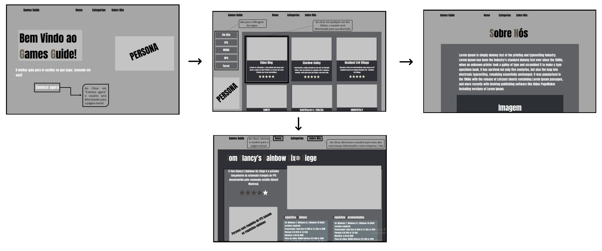
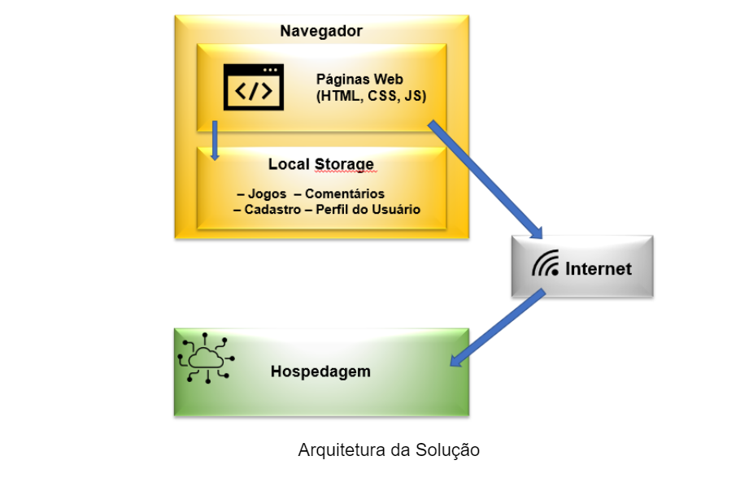
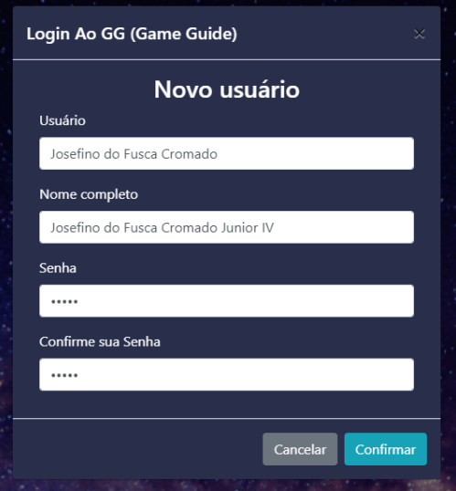
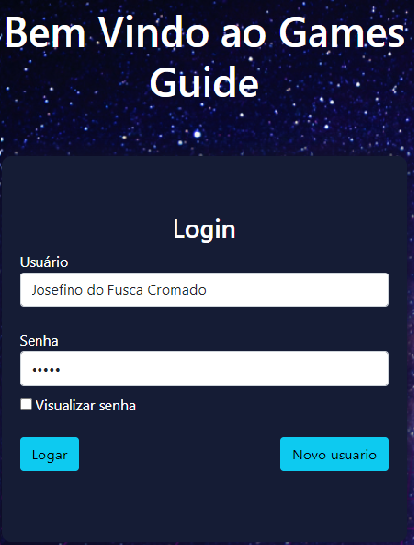

# Informações do Projeto
`TÍTULO DO PROJETO`  

Games Guide

`CURSO` 

Sistemas de Informaçao

## Participantes

- Heitor Freitas Fernandes
- Leonardo Araujo de Oliveira
- Maria Luisa Couto Fernandes
- Matheus Gabriel Gonçalves Cunha de Oliveira
- Mayara Aya Kimura
- Víctor Henrique Cutrim Silva

# Estrutura do Documento

- [Informações do Projeto](#informações-do-projeto)
  - [Participantes](#participantes)
- [Estrutura do Documento](#estrutura-do-documento)
- [Introdução](#introdução)
  - [Problema](#problema)
  - [Objetivos](#objetivos)
  - [Justificativa](#justificativa)
  - [Público-Alvo](#público-alvo)
- [Especificações do Projeto](#especificações-do-projeto)
  - [Personas e Mapas de Empatia](#personas-e-mapas-de-empatia)
  - [Histórias de Usuários](#histórias-de-usuários)
  - [Requisitos](#requisitos)
    - [Requisitos Funcionais](#requisitos-funcionais)
    - [Requisitos não Funcionais](#requisitos-não-funcionais)
  - [Restrições](#restrições)
- [Projeto de Interface](#projeto-de-interface)
  - [User Flow](#user-flow)
  - [Wireframes](#wireframes)
- [Metodologia](#metodologia)
  - [Divisão de Papéis](#divisão-de-papéis)
  - [Ferramentas](#ferramentas)
  - [Controle de Versão](#controle-de-versão)
- [**############## SPRINT 1 ACABA AQUI #############**](#-sprint-1-acaba-aqui-)
- [Projeto da Solução](#projeto-da-solução)
  - [Tecnologias Utilizadas](#tecnologias-utilizadas)
  - [Arquitetura da solução](#arquitetura-da-solução)
- [Avaliação da Aplicação](#avaliação-da-aplicação)
  - [Plano de Testes](#plano-de-testes)
  - [Ferramentas de Testes (Opcional)](#ferramentas-de-testes-opcional)
  - [Registros de Testes](#registros-de-testes)
- [Referências](#referências)

# Introdução

## Problema

A grande variedade de jogos disponíveis atualmente é maravilhosa, não obstante pode ser ao 
mesmo tempo bem assustadora, principalmente para pessoas que estão indecisas sobre com qual título, 
dentre os vários presentes no mercado, irão gastar seu tempo e dinheiro.  

## Objetivos

Idealizamos uma aplicação web, um site que reunisse as principais recomendações de jogos em 
alta, separando-os por categoria, trazendo informações gerais sobre cada título ofertado, além de suas 
especificações e requisitos de sistema. Dessa forma, poderiamos tranquilizar o futuro usuário, pois o 
mesmo saberia se o jogo escolhido funcionaria da forma coesa em sua máquina.

## Justificativa

Grande parte das pessoas que estão procurando o que jogar ficam indecisas por conta da grande quantidade de jogos no mercado, a criação de uma ferramenta que direcione o usuário ao seu objetivo facilitaria o processo por parte do usuário, proporcionando um grande ganho de tempo, além também de exibir as informações sobre o jogo para o usuário, como as avaliações, especificações e a sua descrição, permitindo uma maior certeza sobre o que escolher.

## Público-Alvo

O público-alvo principal seria jovens de 12 à 25 anos. O projeto do site Games Guide (GG!) é sobre um espaço voltado para jogos de mídias digitais, onde o público alvo teria acesso a recomendações sobre quais jogos jogar de acordo com suas respectivas avaliações, além de especificações de requisitos mínimos de sistema.

# Especificações do Projeto

A elaboração da persona e do mapa de empatia foi realizada com base em pesquisas feitas pelos integrantes do grupo, com as informações adquiridas o foi estabelecida uma média para a criação das caracteristicas da persona. O processo foi realizado pelo *Discord* e por encontros pós aulas.

## Personas e Mapas de Empatia

**O que ele pensa e sente?** Ele quer ser melhor em jogos. O que mais o preocupa é que, apesar 
de  possuir  uma  excelente  carreira,  não  consegue  se  divertir  o  suficiente  por  não  ser  um  bom 
gamer.

**O que ele escuta?** Apesar de estar feliz e relativamente satisfeito com a sua vida, as pessoas ao 
seu redor esperam que ele saia mais de casa, faça mais amigos e vá “curtir o momento”, 
visitando novos lugares, indo para festas, conhecendo novas pessoas etc.

**O que ele vê?** Prefere interagir com informações de cunho tecnológico, não se atentando muito 
às notícias sobre atualidade e possui uma vida social “pequena”.

**O que ele fala e faz?** Fora do seu círculo profissional, gosta de vestir roupas com estamparias 
de jogos e animes. É um(a) ¿pessoa? ¿sapo? tranquila(o), procura não expressar muito quando 
está chateado/estressado, tenta ao máximo transmitir essa sensação às pessoas ao seu redor.

**Quais  são  as  dores?**  Ele  se  chateia  muito  por  não  conseguir  jogar  bem,  apesar  de  desde 
criança ter contato com o “mundo tecnológico”. Sem falar sobre hobbies, um de seus maiores 
medos é se encontrar em uma profissão onde não exerça o que realmente ama: 
desenvolvimento, e onde também não possa mostrar suas competências.

**Quais são os objetivos?** Ele almeja sempre o sucesso profissional. Consegue se enturmar bem 
com  seus  colegas  de  equipe,  pretende  ter  uma  estabilidade  financeira  cada  vez  maior  para 
conhecer alguns países que possuem cultura gamer/geek.

## Histórias de Usuários

Com base na análise das personas forma identificadas as seguintes histórias de usuários:

|EU COMO... `PERSONA`| QUERO/PRECISO ... `FUNCIONALIDADE` |PARA ... `MOTIVO/VALOR`                 |
|--------------------|------------------------------------|----------------------------------------|
|Usuário do sistema  | Recomendações de jogos com reviews sinceras | Encontrar o que jogar mais rapidamente e com base em avaliações |
|Usuário do sistema  | Encontrar facilmente as configurações necessarias para cada jogo | Não perder tempo procurando os requisitos de cada jogo |
|Usuário do sistema  | Achar jogos com base na categoria | Encontrar jogos que gosta mais rapidamente |

## Requisitos

As tabelas que se seguem apresentam os requisitos funcionais e não funcionais que detalham o escopo do projeto.

### Requisitos Funcionais

|ID    | Descrição do Requisito  | Prioridade |
|------|-----------------------------------------|----|
|RF-001| Nosso site oferecerá recomendações de jogos | ALTA | 
|RF-002| Todos os jogos terão avaliações de acordo com uma média retirada das principais mídias de crítica Geek | ALTA | 
|RF-003| Nosso site oferecerá recomendações de peças para computador de acordo com cada jogo | ALTA | 
|RF-004| Nossos usuários terão a opção de se cadastrar no site, com o intuito de receber benefícios | MÉDIA | 
|RF-005| Nossos usuários poderão filtrar os jogos por categorias | ALTA | 
|RF-006| Também ofertaremos o espaço para que nossos usuários também opinem e recomendem seus jogos favoritos | MÉDIA | 
|RF-007| Nosso site oferecerá também uma categoria especial voltada apenas aos RPG’s de Mesa, onde será disponibilizado uma introdução sobre o que são e uma aba com os principais livros | ALTA | 
|RF-008| O site possuirá alguns Easter Egg’s, que ficarão escondidos em diversos elementos do mesmo | MÉDIA | 
|RF-009| Categoria “Em Alta”, onde serão separados os principais títulos em alta do momento | ALTA | 
|RF-010| Opção para que os jogos sejam procurados através de uma barra de pesquisa | ALTA | 
|RF-011| Os usuários poderão cadastrar informações de login para acessar o conteúdo presente no site | ALTA | 
|RF-012| Os usuários poderão testar seus conhecimentos sobre RPG de Mesa através de um mini Quiz | MÉDIA | 
|RF-013| O site possuirá a opção de alterar seus temas de cores padrão, caso assim o usuário desejar | MÉDIA | 

### Requisitos não Funcionais

|ID     | Descrição do Requisito  |Prioridade |
|-------|-------------------------|----|
|RNF-001| Por ser uma aplicação web, o sistema deve ser multiplataforma – Windows, Linux e macOs | ALTA | 
|RNF-002| O seu desenvolvimento dese ser em linguagem HTML, CSS e JavaScript | ALTA | 
|RNF-003| O site deve ser fluido e dinâmico | ALTA | 
|RNF-004| O site deve ser claro para todos os usuários | ALTA | 
|RNF-005| O site deve ser compatível com computadores, smartphones e televisões  | ALTA | 

## Restrições

O projeto está restrito pelos itens apresentados na tabela a seguir.

|ID| Restrição                                             |
|--|-------------------------------------------------------|
|01| O projeto deverá ser entregue até o final do semestre |
|02| Não pode ser desenvolvido um módulo de backend        |

# Projeto de Interface

O site games guide conta com uma interface simples e objetiva, entendemos que o usuário não pode fazer esforço para entender a dinâmica do site portanto o grupo pensou em uma interface clara e objetiva, botões auto-explicativos e um fluxo simples para facilitar a utilização da ferramenta.

## User Flow

## Wireframes

# Metodologia

Nessa seção será especificado sobre a metodoloiga adotada pelo grupo durante a execução da sprint 1, além também de demonstrar o processo de Design Thinking, detalhando a divisão de papéis, as ferramentas utilizadas e como foi aplicado o controle de versão.

## Divisão de Papéis

Durante toda a duração da primeira sprint, todos os integrantes do grupo fizeram as tarefas em conjunto.

- Ideação do que seria necessário para o site
- Entrevistas com pelo menos 4 pessoas para cada integrante
- Confecção da Matriz CSD
- Confecção das escalas de cinza, sendo a melhor decidida por meio de votação
- Encontros após as aulas e Calls realizadas pelo discord, com o intuito de retirar dúvidas e organizar as atividades

É válido ressaltar que a partir das próximas sprints, utilizaremos a plataforma de gestão 
Trello, para dividir nossas tarefas e controlar de forma mais eficiente nossas atividades e 
prioridades.

## Ferramentas

| Ambiente  | Plataforma              |Link de Acesso |
|-----------|-------------------------|---------------|
|Processo de Design Thinkgin | Discord | Sem link de acesso |
|Comunicação | Discord | Sem link de acesso | 
|Repositório de código | GitHub | https://github.com/PBE-TIAW-2022-1/tiaw-pbe-20221-matheusfnl.git | 
|Protótipo Interativo | Figma | https://www.figma.com/file/FLrGJQZYwt2yhz74lpSFdt/Games-Guide-Prototype-(Copy)?node-id=0%3A1 | 
|Editor de código | Visual Studio Code | Sem link de acesso | 

## Controle de Versão

A ferramenta de controle de versão escolhida foi o próprio Git, sendo o próprio github o responsável pela hospedagem do repositório. 

Por conta da sprint 1 ser mais "simples" em relação ao código do que as outras, foi designado apenas uma pessoa para enviar ele ao repositório, portanto não foi necessário a definição de nenhum cargo e nenhuma tag dentro do projeto.

Em relação as outras sprints foi decidido o uso das seguintes tags:
- bugfix - funcionalidade com problemas.
- aprimorar-aparencia - funcionalidade precisa ser melhorada visualmente.
- aprimorar-codigo - funcionalidade precisa ser melhorada logicamente. 
- feature - nova funcionalidade a ser implementada.
- prioridade-baixa - funcionalidade com prioridade baixa
- prioridade-media - funcionalidade com prioridade média
- prioridade-alta - funcionalidade com prioridade alta

Em relação às branchs, seguiremos o padrão estabelecido.
- master - versão estável já testada do software
- unstable - versão já testada do software, porém instável
- testing - versão em testes do software
- dev - versão de desenvolvimento do software

# Projeto da Solução

A seção de implementação da solução visa mostrar os detalhes técnicos da solução criada pela equipe, abrangendo a arquitetura da solução, estruturas de dados e telas implementadas.

## Arquitetura da solução

Os elementos que constituem a solução criada são apresentados na figura a seguir:

 A solução implementada conta com os seguintes módulos:
- **Navegador** - Interface básica do sistema
 - - **Páginas Web** - Conjunto de arquivos HTML, CSS, JavaScript e imagens que compõem o projeto.
 - - **Local Storage** - armazenamento mantido no Navegador que contém:
  - - - **Página de Jogos** – seção de categoria e páginas de jogos
  - - - **Comentários** – opiniões de usuários sobre os jogos
  - - - **Login** – página para registro e login de usuários
 - **Hospedagem** - local na Internet onde as páginas são mantidas e acessadas pelo navegador.

# Hospedagem

Para o ambiente de hospedagem do site do projeto, foi utilizada a plataforma do GitHub Pages, conforme a URL: https://mayara-aya-kimura.github.io/TIAW.github.io/

# Avaliação da Aplicação

O processo de realização dos testes da solução desenvolvida está documentado na
seção que se segue e traz os planos de testes de software e de usabilidade, na
sequência, o registro dos testes realizados.

## Plano de Testes de Software

- Requisitos para realização do teste:
Site publicado na Internet;
- Navegador da Internet - Chrome, Firefox ou Edge;
- Conectividade de Internet para acesso à nossa Aplicação Web.

Os testes funcionais a serem realizados no aplicativo são descritos a seguir.

|Caso de Teste| CT-01 Fazer registro no site|
|--|-------------------------------------------------------|
| Requisitos Associados | RF-11 - Os usuários poderão cadastrar informações de login para acessar o conteúdo presente no site. |
| Objetivo do Teste | Verificar se é possível realizar o registro de novos usuários. |
| Passos | 1. Acessar o navegador;   2. Informar o endereço do site;   3. Visualizar a home page;   4. Clicar em "Comece Agora";   5. Clicar em "Novo usuário";   6. Inserir os dados para o registro e clicar em "Confirmar". |
| Critérios de Êxito | * Após a realização do registro do novo usuário, o site deve apresentar um alerta informando que o usuário foi salvo com sucesso. |

|Caso de Teste| CT-02 Fazer login no site|
|--|-------------------------------------------------------|
| Requisitos Associados | RF-11 - Os usuários poderão cadastrar informações de login para acessar o conteúdo presente no site. |
| Objetivo do Teste | Verificar se é possível realizar o login de usuários já cadastrados. |
| Passos | 1. Acessar o navegador;   2. Informar o endereço do site;   3. Visualizar a home page;   4. Clicar em "Comece Agora";   5. Informar o usuário e senha que foram utilizados durante o registro de usuário;   6. Clicar em "Logar". |
| Critérios de Êxito | * Após inserir os dados registrados e clicar no botão “Logar”, o usuário deve ser redirecionado para a aba do catálogo de jogos. |

|Caso de Teste| CT-03 Visualizar os títulos do Catálogo de jogos|
|--|-------------------------------------------------------|
| Requisitos Associados | RF-01 - Nosso site oferecerá recomendações de jogos.   RF-02 - Todos os jogos terão avaliações de acordo com uma média retirada das principais mídias de crítica Geek. |
| Objetivo do Teste | Verificar se os títulos estão sendo apresentados corretamente. |
| Passos | 1. Acessar o navegador;   2. Informar o endereço do site;   3. Visualizar a aba do “Catálogo” de jogos. |
| Critérios de Êxito | * Após passar pela parte do login, o usuário deve ser redirecionado para a aba de catálogo de jogos.   * Os jogos disponibilizados devem apresentar uma imagem, nome, breve descrição e nota (estrelas). |

|Caso de Teste| CT-04 - Filtro de jogos funcional |
|--|-------------------------------------------------------|
| Requisitos Associados | RF-05 - Nossos usuários poderão filtrar os jogos por categoria.   RF-09 - Também disponibilizamos uma categoria “Em Alta”, onde será disponibilizado os principais títulos em alta do momento. |
| Objetivo do Teste | Verificar se o filtro de categorias está funcionando corretamente. |
| Passos | 1. Acessar o navegador;   2. Informar o endereço do site;   3. Visualizar a aba do “Catálogo” de jogos.   4. Clicar nos filtros que se localizam na lateral esquerda da página. |
| Critérios de Êxito | * Após passar pela parte do login, o usuário deve ser redirecionado para a aba de catálogo de jogos. |

|Caso de Teste| CT-05 - Função “Pesquisar jogos |
|--|-------------------------------------------------------|
| Requisitos Associados | RF-10 - Disponibilizamos a opção para que os jogos sejam procurados através de uma barra de pesquisa |
| Objetivo do Teste | Verificar se é possível pesquisar os jogos presentes no site pelo nome. |
| Passos | 1. Acessar o navegador;   2. Informar o endereço do site;   3. Digitar o nome de algum jogo na barra de pesquisa.   4. Clicar na miniatura do jogo desejado. |
| Critérios de Êxito | * Ao digitar o nome de algum jogo na barra de pesquisa, caso o mesmo esteja em nosso site, aparecerá uma miniatura, contendo imagem e nome, referente ao que fora digitado.   * Após clicar na miniatura, o usuário será direcionado para a página com detalhes do jogo |

|Caso de Teste| CT-06 - Visualizar os detalhes dos jogos |
|--|-------------------------------------------------------|
| Requisitos Associados | RF-01 - Nosso site oferecerá recomendações de jogos   RF-02 - Todos os jogos terão avaliações de acordo com uma média retirada das principais mídias de crítica Geek.   RF-03 - Nosso site oferecerá recomendações de peças para computador de acordo com os requisitos de cada jogo. |
| Objetivo do Teste | Verificar se os detalhes dos jogos estão sendo apresentados corretamente. |
| Passos | 1. Acessar o navegador;   2. Informar o endereço do site;   3. Visualizar o catálogo de jogos ou digitar o nome do jogo na barra de pesquisa.   4. Clicar no card contendo o jogo.   5. Visualizar os detalhes do jogo selecionado. |
| Critérios de Êxito | * Após clicar no card de algum jogo, seja no catálogo ou na barra de pesquisa, o usuário será redirecionado para uma aba contendo detalhes do jogo selecionado.   * A aba de detalhes deve conter o nome, imagem, descrição, requisitos mínimos, requisitos recomendados e nota do jogo selecionado |

|Caso de Teste| CT-07 - Adicionar comentários |
|--|-------------------------------------------------------|
| Requisitos Associados | RF-06 - Ofertamos um espaço para que nossos usuários opinem sobre seus jogos favoritos. |
| Objetivo do Teste | Verificar se é possível adicionar, editar e excluir comentários sobre os jogos. |
| Passos | 1. Acessar o navegador;   2. Informar o endereço do site;   3. Visualizar o catálogo de jogos ou digitar o nome do jogo na barra de pesquisa.   4. Clicar no card contendo o jogo.   5. Visualizar os detalhes do jogo selecionado.   6. Inserir informações na aba “Escreva um comentário”, localizada no canto inferior direito da página. |
| Critérios de Êxito | * Deverá ser possível adicionar, excluir e editar comentários sobre o jogo selecionado. |

|Caso de Teste| CT-08 - Visualizar a página do RPG de Mesa |
|--|-------------------------------------------------------|
| Requisitos Associados | RF-07 - Nosso site oferecerá uma categoria especial voltada apenas aos RPG’s de Mesa, onde será disponibilizado uma introdução sobre o que são e uma aba com os principais livros. |
| Objetivo do Teste | Verificar se as informações estão sendo apresentadas corretamente. |
| Passos | 1. Acessar o navegador;   2. Informar o endereço do site;   3. Clicar no ítem “RPG de Mesa”, localizado no header da página. |
| Critérios de Êxito | * Após clicar em “RPG de Mesa”, o usuário será redirecionado para uma aba contendo uma breve introdução a esse gênero. |

|Caso de Teste| CT-09 - Mini-quiz RPG de Mesa |
|--|-------------------------------------------------------|
| Requisitos Associados | RNF-06 - Os usuários poderão testar seus conhecimentos sobre RPG de Mesa através de um mini Quiz. |
| Objetivo do Teste | Verificar se o mini-quiz está funcional. |
| Passos | 1. Acessar o navegador;   2. Informar o endereço do site;   3. Clicar no ítem “RPG de Mesa”, localizado no header da página.   4. Clicar no botão “Quiz RPG”, localizado no canto inferior direito da página.   5. Realizar o Quiz. |
| Critérios de Êxito | * Após a realização do mini-quiz, o usuário será informado sobre sua pontuação.   * Será possível refazê-lo ou retornar para a aba de RPG de Mesa através dos botões “Refazer Quiz” e ”Retornar” |

|Caso de Teste| CT-10 - Visualizar os títulos do Catálogo de livros para RPG de Mesa |
|--|-------------------------------------------------------|
| Requisitos Associados | RF-07 - Nosso site oferecerá uma categoria especial voltada apenas aos RPG’s de Mesa, onde será disponibilizado uma introdução sobre o que são e uma aba com os principais livros. |
| Objetivo do Teste | Verificar se os títulos ofertados estão sendo apresentados corretamente. |
| Passos | 1. Acessar o navegador;   2. Informar o endereço do site;   3. Clicar no ítem “RPG de Mesa”, localizado no header da página.   4. Clicar no botão “Comece aqui”, localizado no canto superior esquerdo da página. |
| Critérios de Êxito | * Após clicar no botão “Comece aqui”, o usuário deverá ser redirecionado para uma página contendo recomendações dos principais títulos do RPG de mesa.   * Cada título precisa apresentar uma imagem, breve descrição e um botão que possibilite ao usuário comprar o livro através da Amazon. |

|Caso de Teste| CT-11 - - Visualizar os títulos do Catálogo de livros para RPG de Mesa a venda na Amazon |
|--|-------------------------------------------------------|
| Requisitos Associados |RF-07 - Nosso site oferecerá uma categoria especial voltada apenas aos RPG’s de Mesa, onde será disponibilizado uma introdução sobre o que são e uma aba com os principais livros. |
| Objetivo do Teste | Verificar se o redirecionamento para o site da Amazon está de acordo com o livro selecionado. |
| Passos | 1. Acessar o navegador;   2. Informar o endereço do site;   3. Clicar no ítem “RPG de Mesa”, localizado no header da página.   4. Clicar no botão “Comece aqui”, localizado no canto superior esquerdo da página.   5. Escolher um dos títulos ofertados e clicar no botão “Compre aqui” |
| Critérios de Êxito | * Após clicar no botão “Compre aqui”, o usuário deve ser redirecionado para o site da Amazon br, com o intuito de visualizar o preço e/ou comprar o livro selecionado. |

|Caso de Teste| CT-12 - Mini-games escondidos no site |
|--|-------------------------------------------------------|
| Requisitos Associados | RNF-07 - O site possuirá alguns Easter Egg’s, cujos quais ficarão escondidos em diversos elementos do mesmo. |
| Objetivo do Teste | Verificar se os mini-games estão funcionais. |
| Passos | 1. Acessar o navegador;   2. Informar o endereço do site;   3. Clicar em algumas imagens da nossa persona que estão espalhadas por todo o site.   4. Jogar o mini-game encontrado. |
| Critérios de Êxito | * Após clicar nas personas espalhadas pelo site, o usuário será redirecionado para uma página que contém um mini-game de algum jogo retrô.   * Serão 3 jogos espalhados pelo site, sendo eles: Space invaders, Snake game e Dinossaur game. |

|Caso de Teste| CT-13 - Dark/Light -mode |
|--|-------------------------------------------------------|
| Requisitos Associados | RNF-08 - O site possuirá a opção de alterar seus temas de cores padrão, caso assim o usuário desejar. |
| Objetivo do Teste | Verificar se é possível alterar o tema de cores do site. |
| Passos | 1. Acessar o navegador;   2. Informar o endereço do site;   3. Clicar no ícone do sol/lua que se encontra no header da página. |
| Critérios de Êxito | * Após clicar no ícone do sol/lua, as cores das letras devem ser alteradas, bem como a cor do header e background-image.   * Mesmo atualizando a página, o modo alterado deve se manter, devido a utilização de um LocalStorage. |

|Caso de Teste| CT-14 - Preloader |
|--|-------------------------------------------------------|
| Requisitos Associados | RNF-09 - Disponibilizaremos um preloader nas principais páginas do site. |
| Objetivo do Teste | Verificar se há um preloader (gif do pacman) ao carregar as páginas. |
| Passos | 1. Acessar o navegador;   2. Informar o endereço do site;   3. Carregar qualquer uma das abas disponíveis (Com exceção da home page e registro/login de usuário).   4. Observar o gif animado ao carregar as páginas. |
| Critérios de Êxito | * Após carregar as páginas mencionadas, deve ser possível observar um gif animado do pacman como preloader. |

## Registros de Testes de Software

Os resultados obtidos nos testes de software realizados são descritos nas Tabelas a seguir.

| CT-14 - Fazer registro no site |
|---------------------------------------------------------|
|   |
| **Resultados:** Cadastro realizado com sucesso.   **Bugs encontrados:** Nenhum.   **Melhorias sugeridas:** A mensagem “Conta criada com sucesso” estava aparecendo em forma de alerta, então foi sugerido que aparecesse uma mensagem em HTMl, como mostrado acima. |

| CT-14 - Fazer login no site |
|---------------------------------------------------------|
|   |
| **Resultados:** Login realizado com sucesso.   **Bugs encontrados:** Nenhum.   **Melhorias sugeridas:** Nenhuma. |

# Referências

......  COLOQUE AQUI O SEU TEXTO ......

> Inclua todas as referências (livros, artigos, sites, etc) utilizados
> no desenvolvimento do trabalho.
> 
> **Links Úteis**:
> - [Formato ABNT](https://www.normastecnicas.com/abnt/trabalhos-academicos/referencias/)
> - [Referências Bibliográficas da ABNT](https://comunidade.rockcontent.com/referencia-bibliografica-abnt/)